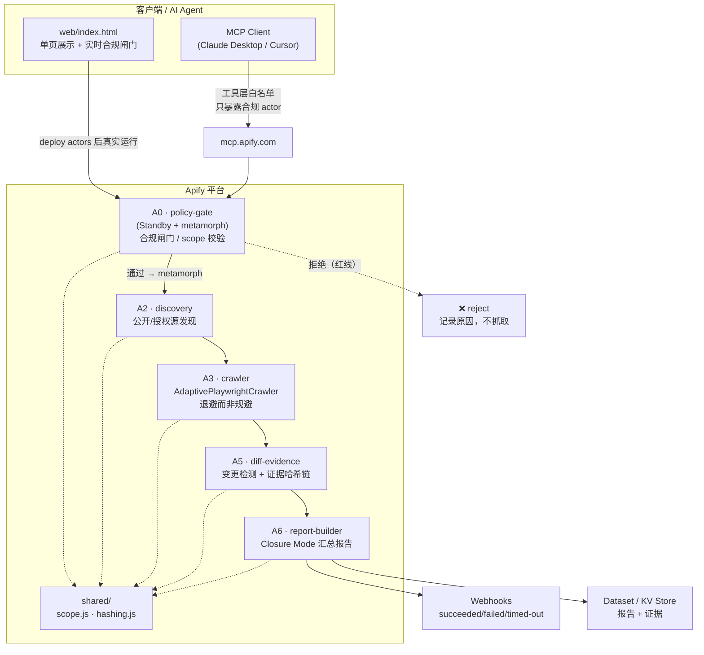

# MirrorTrace（合规版） / Self Footprint Audit Pro

> 把"忍不住追踪私人个体"的冲动，反转成"审计并保护你自己"的工具。
> Turn compulsive checking into self-protection.

**MirrorTrace（合规版）** 是一套基于 [Apify](https://apify.com) 的工具：审计 **你自己** 的公开数字足迹、为涉及你本人的公开事件留存证据、监控 **已授权 / 公众人物 / 品牌** 来源，并通过 **Closure Mode（了断模式）** 帮你减少强迫性反复查看。

它**明确不是**一个追踪私人个体的工具。

---

## 0. 合规反转（The Compliance Inversion）—— 先讲这个

非同意追踪流程把技术对准 **别人**。我们把同样的技术能力，整段反转，对准 **你自己 + 公开信息 + 已授权来源**：

| 旧的冲动（不做） | 反转后的产品（做） |
| --- | --- |
| 追踪私人个体在哪、和谁在一起 | 审计 **我自己** 在公网上暴露了什么（self-audit） |
| 偷看私密社交账号 | 只看 **公开** 页面 + **已授权** 来源 |
| 反复刷新、越查越焦虑 | **Closure Mode**：限频、汇总、了断，减少强迫性查看 |
| 留对方的"黑料" | 为 **涉及我本人** 的公开事件留 **可验证证据**（哈希链） |

合规不是事后加的免责声明，而是**写进 input_schema、写进 MCP 工具层、写进 policy-gate actor 的代码约束**（compliance-as-code）。

---

## 1. 五个炫技点（5 Highlights）

1. **Metamorph 路由（A0 policy-gate）**
   入口 actor 以 **Standby** 模式常驻，对每个请求先跑合规闸门，再用 `Actor.metamorph()` 把通过的请求 **变形** 成对应的下游 actor（discovery / crawler / diff / report）。不合规的请求在变形前就被拒绝，**永远到不了抓取层**。

2. **MCP 工具层白名单（compliance as a tool boundary）**
   通过 `https://mcp.apify.com?tools=...` 只把 **合规 actor** 暴露给 AI agent。私域抓取类 actor **根本不在工具列表里**，所以 agent **物理上无法调用**。详见 [`mcp/configurator-notes.md`](mcp/configurator-notes.md)。

3. **input_schema enum = compliance-as-code**
   `scope_type` 是一个 **枚举**：`self | consented | public_figure | brand | safety_evidence`。没有 "ex"、没有 "private_individual"。非法 scope 在 schema 校验阶段就被 Apify 平台拒绝，连 actor 代码都进不去。

4. **AdaptivePlaywrightCrawler（A3 crawler）**
   抓取层用 Crawlee 的 `AdaptivePlaywrightCrawler`：能用纯 HTTP 就用 HTTP（快、省），需要渲染才升级到 Playwright 浏览器。自动适配，省算力也省钱。

5. **合规退避，而非规避（backoff, not evasion）**
   遇到 `429 / 403 / robots 限制`，我们 **指数退避 + 尊重 `Retry-After` + 降低并发**，并在报告里 **如实记录"被限流/被拒绝"**。我们 **不** 轮换指纹、不绕验证码、不伪装绕过平台控制。被拒绝就是被拒绝。

---

## 2. 架构图（Architecture）



**数据流**：请求 → A0 合规闸门（拒绝或 metamorph）→ A2 发现源 → A3 自适应抓取 → A5 变更 diff + 证据哈希 → A6 生成 Closure Mode 报告 → Webhook 通知。

---

## 3. 仓库结构（Repo Layout）

```
mirrortrace/
├── README.md                       # 本文件
├── DEPLOY.md                       # Apify 部署 + 静态托管指南
├── actors/                         # 5 个 Apify actor
│   ├── policy-gate/    (A0)        # Standby + metamorph 合规入口
│   ├── discovery/      (A2)        # 公开/授权源发现
│   ├── crawler/        (A3)        # AdaptivePlaywrightCrawler
│   ├── diff-evidence/  (A5)        # 变更检测 + 证据哈希链
│   └── report-builder/ (A6)        # Closure Mode 报告
├── shared/                         # 跨 actor 复用库
│   ├── scope.js                    # scope_type 校验逻辑
│   └── hashing.js                  # 证据哈希
├── web/
│   ├── index.html                  # 自包含单页展示 + 实时合规闸门
│   ├── assets/
│   └── data/
├── mcp/
│   ├── client-config.example.json  # MCP 客户端配置示例
│   └── configurator-notes.md       # 工具层白名单 = 合规控制说明
├── demo/
│   ├── reject-cases.json           # 应被拒绝的红线案例
│   └── allowed-urls.json           # 合规放行案例
└── docs/
    ├── COMPLIANCE.md
    ├── PLATFORM-POLICY-MATRIX.md
    ├── PRIVACY-AND-RETENTION.md
    └── THREAT-MODEL.md
```

> 注：`actors/` 与 `web/` 由团队并行开发中，部分目录可能仍为骨架。

---

## 4. 快速开始（Quick Start）

### A. 只看 Demo（无需 Apify 账号）

直接打开单页展示，它自包含、内置实时合规闸门，可本地试拒绝/放行逻辑：

```bash
cd mirrortrace
open web/index.html
# 或起一个静态服务器（推荐，避免 file:// 限制）：
python3 -m http.server 8080 --directory web
# 然后访问 http://localhost:8080
```

### B. 真实运行（需要真实 Apify 账号）

部署 5 个 actor 并配置 metamorph 目标、Schedule、Webhook。完整步骤见 [`DEPLOY.md`](DEPLOY.md)：

```bash
npm i -g apify-cli
apify login                          # 用你自己的 Apify 账号
cd actors/policy-gate && apify push  # 对 5 个 actor 各执行一次
# ...discovery / crawler / diff-evidence / report-builder 同理
```

> **诚实声明**：真实抓取、Schedule、Webhook 都需要 **你自己的真实 Apify 账号和 `APIFY_TOKEN`**。本仓库不内置任何凭据，所有 token / username 均为占位符（`YOUR_USERNAME` / `<APIFY_TOKEN>`）。

---

## 5. 五种 scope_type（合规作用域）

`scope_type` 是 `input_schema` 中的 **enum**，是合规的第一道闸：

| scope_type | 含义 | 典型用途 |
| --- | --- | --- |
| `self` | 审计你 **自己** 的公开足迹 | "我的名字 / 邮箱在公网暴露了什么？" |
| `consented` | 对方 **明确授权** 的来源 | 家人、团队成员书面同意被监控的公开页面 |
| `public_figure` | 公众人物的 **公开** 信息 | 媒体、政客、KOL 的公开声明 |
| `brand` | 品牌 / 公司公开来源 | 品牌声誉监控、官方公告变更 |
| `safety_evidence` | 涉及 **你本人** 的安全/法律证据 | 保全针对你本人的公开骚扰/诽谤证据 |

任何不属于上述五类的请求（尤其是"私人个体"）**在 schema 层即被拒绝**。

---

## 6. 硬红线（Hard Red Lines）

以下行为产品**结构性禁止**（不是承诺，是代码与工具层强制）：

- ❌ **不** 追踪私人个体（private-individual tracking）
- ❌ **不** 做恋爱关系 / 性别推断（romance / gender inference）
- ❌ **不** 抓取私域社交（IG / FB / Tinder 等私密内容）
- ❌ **不** 绕过任何平台控制（验证码、登录墙、指纹检测、robots）
- ❌ **不** 伪装 / 规避；遇限流只 **退避并如实记录**

红线如何被强制：scope enum（schema）→ policy-gate（A0 代码）→ MCP 工具白名单（agent 层）→ crawler 退避策略（抓取层）。四层叠加。

---

## 7. 文档（Docs）

- [`docs/COMPLIANCE.md`](docs/COMPLIANCE.md) — 合规框架与红线定义
- [`docs/PLATFORM-POLICY-MATRIX.md`](docs/PLATFORM-POLICY-MATRIX.md) — 各平台政策对照矩阵
- [`docs/PRIVACY-AND-RETENTION.md`](docs/PRIVACY-AND-RETENTION.md) — 隐私与数据留存策略
- [`docs/THREAT-MODEL.md`](docs/THREAT-MODEL.md) — 威胁模型（含"被滥用"场景）

---

## 8. 90 秒 Demo 脚本（90-Second Demo Script）

> 目标：在 90 秒内讲清 **合规反转** + **四个炫技点的可见证据**。

**[0:00–0:20] Reject Demo（红线即时拒绝）**
打开 `web/index.html`。粘贴一个 `demo/reject-cases.json` 里的请求（例如：私人个体 IG profile）。实时合规闸门 **立即标红拒绝**，并显示触发的红线规则。强调：请求 **从未到达抓取层**——它在 schema/policy-gate 阶段就死了。

**[0:20–0:45] Self-Audit Demo（自我审计）**
切换到 `scope_type: self`，输入"你自己的"姓名/邮箱（用占位数据）。闸门 **放行**（`demo/allowed-urls.json`），展示 discovery → crawler → diff → report 的流水，最终给出 Closure Mode 汇总："这是你公网暴露的清单，看一次就够了。"

**[0:45–1:10] Backoff Demo（退避而非规避）**
触发一个会返回 `429` 的源。展示 crawler **指数退避 + 尊重 Retry-After + 降并发**，并在报告里 **如实写"被限流，已退避"**。对比说明：我们 **不** 换指纹、不绕验证码。被拒绝就如实记录。

**[1:10–1:30] MCP Demo（工具层白名单）**
展示 `mcp/client-config.example.json`：MCP 客户端只连到 `mirrortrace-policy-gate` + `mirrortrace-report` + `docs`。让 AI agent 尝试调用"私域抓取 actor"——它 **在工具列表里根本不存在**，agent 物理上调不到。合规作为工具边界。收尾回到合规反转主题。

---

## 许可与声明

本工具用于 **自我保护、公开信息审计、已授权监控** 与 **减少强迫性查看**。
使用者须遵守当地法律及各平台服务条款。详见 `docs/`。
