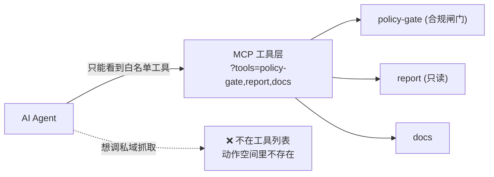

# MCP Configurator Notes — 工具层白名单作为合规控制

> TL;DR：`mcp.apify.com?tools=...` 里的 **工具白名单** 不只是配置，它是 **一道合规边界**。
> 只暴露合规 actor，AI agent 就 **物理上无法** 调用私域抓取类工具。
> 副作用还很香：工具列表更短 → 模型更准 → token 更省。

---

## 1. 它是什么

Apify 的远程 MCP 端点接受一个 `tools` 查询参数，显式列出要暴露给 MCP 客户端的工具：

```
https://mcp.apify.com?tools=YOUR_USERNAME/mirrortrace-policy-gate,YOUR_USERNAME/mirrortrace-report,docs
```

对 MirrorTrace，我们 **只** 白名单这些：

| 暴露的工具 | 为什么安全 |
| --- | --- |
| `YOUR_USERNAME/mirrortrace-policy-gate` | 入口 actor，本身先跑合规闸门（scope enum + 红线）再 metamorph |
| `YOUR_USERNAME/mirrortrace-report` | 只读 Closure Mode 报告，不发起新抓取 |
| `docs` | Apify 文档工具，供 agent 自查用法 |

**没有** 通用抓取 actor、**没有** 私域社交 actor、**没有** 任意 URL fetch 工具被列进去。

---

## 2. 为什么这是合规控制（而不仅是配置）

这是一个 **能力边界（capability boundary）**，而不是一句提示词里的"请不要"。

- **提示词约束是软的**：你可以写"不要抓私人账号"，但越狱/诱导/上下文漂移都可能突破它。
- **工具白名单是硬的**：如果 `mirrortrace-private-scraper` **不在工具列表里**，那么无论 agent 多想调用、用户多会诱导，**这个工具调用根本不存在于 agent 的动作空间**。调不到就是调不到。



这与产品的四层红线强制一致（scope enum → policy-gate 代码 → **MCP 工具白名单** → crawler 退避）。MCP 白名单是 **agent 层** 那一层。

---

## 3. 顺带的工程收益

把工具列表收窄到 3 个，不只是合规，还实打实改善 agent 质量：

1. **更高的工具选择准确率**
   工具越少，模型选错工具/幻觉参数的概率越低。三个明确工具远比"几十个 actor 任你挑"更不容易出错。

2. **更低的 token 成本 / 更长可用上下文**
   每个暴露的工具都要把它的 schema 塞进上下文。白名单 3 个工具 vs. 暴露整个账号的 actor 库，能省下大量系统 prompt token，也给真正的对话留更多空间。

3. **更可审计**
   工具列表是声明式、可 review、可进 PR 的。任何对暴露面的改动都在 diff 里可见——合规评审可以直接盯这一行 `?tools=`。

---

## 4. 配置怎么落地

1. 部署合规 actor（见 `../DEPLOY.md` §2），拿到 `YOUR_USERNAME/mirrortrace-*` 的 ID。
2. 复制 `client-config.example.json` 到你的 MCP 客户端配置（Claude Desktop / Cursor）。
3. 替换 `YOUR_USERNAME` 与 `<APIFY_TOKEN>`（Bearer，来自你自己的 Apify 账号）。
4. **审阅 `?tools=` 这一行**——它就是你的暴露面。任何不在其中的 actor，agent 都调不到。
5. 重启 MCP 客户端使配置生效。

> **传输变更（2026-04-01）**：Apify 的 MCP 端点已从 **SSE** 迁移到 **Streamable HTTP**。
> 用 `streamable-http` transport（或支持远程 MCP 的客户端）；纯 stdio 客户端可用 `mcp-remote` 桥接到同一个远程端点。两种方式共享同一份白名单与同一道合规边界。

---

## 5. Review 清单

- [ ] `?tools=` 只含合规 actor（policy-gate / report）+ `docs`
- [ ] 列表里 **没有** 通用/私域抓取 actor，也没有任意 URL fetch 工具
- [ ] `Authorization: Bearer` 用占位符，真实 token 不入库
- [ ] 使用 `streamable-http`（非已弃用的 SSE）
- [ ] 暴露面变更需经合规评审（盯 `?tools=` 这一行 diff）
